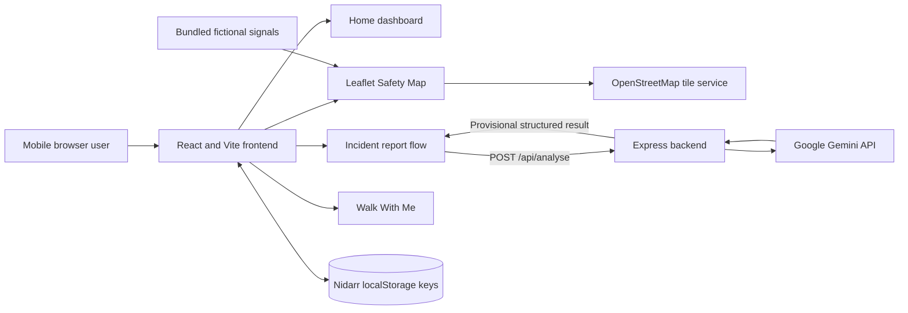

# Nidarr

Nidarr is a mobile-first personal-safety prototype for reporting concerns, viewing transparent safety signals, and running foreground journey check-ins without overstating verification or emergency response.

> **Prototype disclaimer:** Nidarr is a hackathon demonstration, not a production safety service. It does not guarantee safety, verify allegations, recommend a “safest” route, contact police or emergency services, or send real messages, calls, or trusted-contact alerts.

## Problem

People navigating an uncomfortable situation often need several things at once: a simple way to structure what happened, geographic context, and a lightweight journey check-in. These experiences are commonly fragmented, and safety information can easily be presented with more certainty than the evidence supports.

Nidarr explores a single mobile experience that connects those tasks while clearly separating fictional demonstration data, provisional AI analysis, and unverified community submissions.

## Working features

- **Home dashboard:** factual nearby counts, quick actions, active Walk With Me status, and recent pending reports.
- **Safety Map:** OpenStreetMap tiles through React Leaflet, seven bundled fictional demonstration signals, current-location centring, separate demo and pending counts, map details sheets, and tile-failure messaging.
- **Gemini incident analysis:** safety-relevant reports are sent to the Express backend, analysed into structured provisional fields, and protected by an 18-second frontend timeout with retry.
- **Add to Safety Map:** relevant reports can use browser geolocation or a manually selected map point. Gemini never supplies latitude or longitude.
- **Pending community signals:** user submissions are purple, explicitly unverified, stored locally, and kept separate from demonstration risk counts.
- **Walk With Me:** duration-based foreground sessions, optional trusted-contact details, timestamp-derived countdowns, check-in states, simulated help confirmation, latest-location updates, refresh restoration, and a labelled demo trigger.
- **Prototype reset:** Profile contains a confirmed reset control that removes only Nidarr-owned local prototype state while preserving bundled demonstration signals.
- **Mobile navigation:** Home, Safety Map, Report, Walk With Me, and Profile flows are optimized for approximately 360–430px widths.

## End-to-end user flow

1. Open **Home** to see location availability, separate demonstration and pending counts, and quick actions.
2. Open **Report**, choose a category, and describe an incident.
3. The frontend sends the report to `POST /api/analyse`; Gemini returns a provisional structured analysis.
4. If the report is safety-relevant, select **Add to Safety Map**. Irrelevant reports are not offered this action.
5. Confirm coordinates using browser location or by tapping the Leaflet picker.
6. Save the report as a **Pending community signal** and open its purple marker on the Safety Map.
7. Optionally start **Walk With Me**, monitor the timestamp-based countdown, and complete a safe check-in or demonstrate the simulated help state.

## Technology stack

| Layer | Technology |
| --- | --- |
| Frontend | React 19, TypeScript, Vite 8 |
| UI and icons | CSS, Lucide React |
| Mapping | Leaflet, React Leaflet, OpenStreetMap |
| Backend | Express 5, TypeScript, `tsx` |
| AI | Google Gemini via `@google/genai` |
| Prototype persistence | Browser `localStorage` |
| Testing and quality | Playwright with Chromium, Oxlint, TypeScript builds |

## Architecture



The browser owns presentation, geolocation, map interaction, and prototype state. The Express server is the only component that reads the Gemini API key. Vite proxies local `/api` requests to the backend on port `3001`.

## Local setup

### Prerequisites

- A current Node.js LTS release compatible with Vite 8
- npm
- A Gemini API key for the live analysis flow

### Install and configure

```bash
git clone <repository-url>
cd Nidarr-Prototype
npm install
```

Create a local environment file from the supplied example:

```bash
cp .env.example .env
```

PowerShell equivalent:

```powershell
Copy-Item .env.example .env
```

Use placeholders when sharing configuration:

```dotenv
GEMINI_API_KEY=replace_with_your_gemini_api_key
PORT=3001
```

`PORT` is optional and defaults to `3001`. Never commit a populated `.env` file.

### Start locally

Run frontend and backend together:

```bash
npm run dev:all
```

The frontend is normally available at `http://localhost:5173`; the backend health endpoint is `http://localhost:3001/api/health`.

Alternatively, use separate terminals:

```bash
npm run server
npm run dev
```

## Commands

| Command | Purpose |
| --- | --- |
| `npm run dev` | Start the Vite frontend |
| `npm run server` | Start the Express backend in watch mode |
| `npm run dev:all` | Start frontend and backend together |
| `npm run build` | Type-check and build the frontend |
| `npm run build:server` | Type-check the backend |
| `npm run lint` | Run Oxlint |
| `npm run preview` | Preview the production frontend build |
| `npm run test:e2e` | Run all Playwright tests in Chromium |
| `npm run test:e2e:headed` | Run Playwright with a visible browser |
| `npm run test:e2e:ui` | Open Playwright UI mode |
| `npm run test:e2e:install` | Install Playwright Chromium |

## Security decisions

- The Gemini key remains server-side and is read only from `process.env.GEMINI_API_KEY`.
- `.env` is ignored by Git; `.env.example` contains a placeholder only.
- The frontend calls `/api/analyse` and never receives the Gemini credential.
- `localStorage` is used only for prototype persistence of pending reports and the current Walk With Me session.
- Stored prototype data is device-local, unauthenticated, and must not be treated as secure or durable storage.
- Trusted-contact phone numbers are masked in the active-session UI and are not intentionally logged.

## Trust model

- **Seeded map signals are fictional demonstration data.** They are bundled with the application and are not live crime statistics.
- **Community reports remain pending and unverified.** A saved report is not promoted to a verified area-risk label.
- **Gemini analysis is provisional.** It structures the submitted description but does not independently verify an allegation or generate coordinates.
- **No real emergency action occurs.** Nidarr does not send SMS or WhatsApp messages, place calls, contact police or emergency services, or notify trusted contacts.
- **Walk With Me is foreground-only.** It stores only starting/latest coordinates for the prototype and does not perform background tracking.

## Testing

The current Playwright suite has **17/17 passing tests** in Chromium. Coverage includes:

- 360px, 390px, and 430px mobile viewports
- horizontal-overflow and critical-control visibility checks
- unexpected browser console errors and uncaught page errors
- Gemini timeout, preserved form data, duplicate prevention, and retry
- safety-relevant and irrelevant report flows
- manual location selection and OSM picker failure feedback
- pending-marker persistence and focus cleanup
- geolocation success and denial
- Walk With Me restoration, check-in, simulated help, and watcher cleanup
- prototype reset and unrelated-storage preservation

UI-flow tests mock `/api/analyse`; a real Gemini smoke test should remain separate and optional.

## Known limitations

- No authentication, database, server-side report persistence, or cross-device synchronization.
- Pending reports and Walk With Me state can be cleared with browser storage.
- No moderation or community-verification workflow is implemented.
- Gemini analysis and OpenStreetMap tiles require network access and may be affected by latency, quota, or service availability.
- Browser geolocation can be denied, unavailable, or inaccurate.
- No geocoding, external routing, background location tracking, or objective “safest route” calculation.
- The Profile experience is primarily a placeholder plus prototype reset controls.
- The prototype has not received production privacy, abuse-prevention, accessibility, or security hardening.

## Roadmap

- Firebase or another backend persistence layer for durable, cross-device data
- Moderation, evidence review, and explicit community-verification workflows
- Authentication and authenticated trusted-contact management
- Real notification integrations with clear consent, delivery status, and failure handling
- News-derived safety signals with source citations, freshness rules, and deduplication
- Route-risk research that communicates uncertainty and avoids unsupported safety guarantees

## Team

Team member names are not present in the repository materials, so no names have been inferred or added here.
