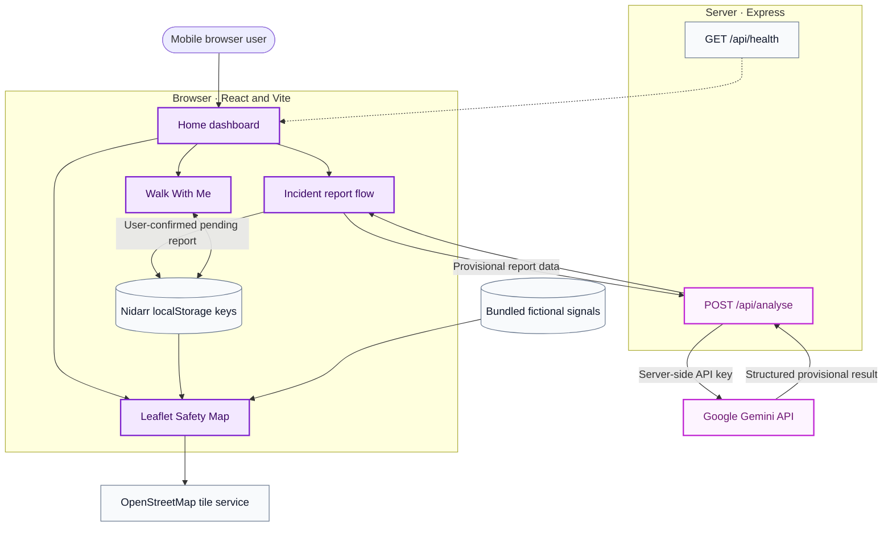

<div align="center">
  

  <h1>Nidarr</h1>

  <p><strong>A mobile-first personal-safety prototype for clearer reporting, transparent safety signals, and foreground journey check-ins.</strong></p>

  <a href="#working-features">
    
  </a>

  <p>
    
    
    
    
    
    
    
  </p>

  <sub>React + Vite frontend · Express backend · Gemini-powered provisional analysis · OpenStreetMap + Leaflet</sub>
</div>

---

> [!IMPORTANT]
> **Nidarr is a hackathon prototype, not a production safety service.** It does not guarantee safety, verify allegations, recommend a "safest" route, contact police or emergency services, or send real messages, calls, or trusted-contact alerts.

## The problem

People navigating an uncomfortable situation often need several things at once: a simple way to structure what happened, geographic context, and a lightweight journey check-in. These experiences are commonly fragmented, and safety information can easily be presented with more certainty than the evidence supports.

Nidarr explores one mobile experience that connects those tasks while clearly separating **fictional demonstration data**, **provisional AI analysis**, and **unverified community submissions**.

<div align="center">
  
</div>

<a id="working-features"></a>

## Working features

| | |
| --- | --- |
| **🏠 Home dashboard**<br/>Factual nearby counts, quick actions, active Walk With Me status, and recent pending reports. | **🗺️ Safety Map**<br/>OpenStreetMap through React Leaflet, seven bundled fictional signals, current-location centring, separate demo/pending counts, details sheets, and tile-failure messaging. |
| **✨ Gemini incident analysis**<br/>Structured provisional analysis through the Express backend, protected by an 18-second frontend timeout with retry. | **📍 User-confirmed location**<br/>Relevant reports use browser geolocation or a manually selected map point. Gemini never supplies latitude or longitude. |
| **🟣 Pending community signals**<br/>User reports are purple, explicitly unverified, device-local, and separate from demonstration risk counts. | **🚶 Walk With Me**<br/>Foreground-only timed sessions, optional trusted-contact details, timestamp-derived countdowns, check-ins, simulated help, latest-location updates, restoration, and a labelled demo trigger. |
| **🧹 Prototype reset**<br/>A confirmed Profile control removes only Nidarr-owned local state while preserving bundled demo signals. | **👤 Local profile**<br/>Device-local personalisation, optional home-area text, trusted-contact Walk defaults, activity, and browser location availability. |

## Product workflow

<table>
  <tr>
    <td align="center"><strong>1 · Report</strong><br/><sub>Choose a category and describe the concern.</sub></td>
    <td align="center"><strong>2 · Analyse</strong><br/><sub>Gemini returns a provisional structured result.</sub></td>
    <td align="center"><strong>3 · Confirm</strong><br/><sub>The user supplies or selects coordinates.</sub></td>
    <td align="center"><strong>4 · Map</strong><br/><sub>The report remains pending and unverified.</sub></td>
  </tr>
</table>

1. Open **Home** for location availability, separate demonstration and pending counts, and quick actions.
2. Open **Report**, select a category, and submit an incident description to `POST /api/analyse`.
3. If Gemini considers the report safety-relevant, choose **Add to Safety Map**. Irrelevant reports are not offered this action.
4. Confirm coordinates with browser geolocation or by tapping the Leaflet picker.
5. Save the report as a **Pending community signal** and inspect its purple marker.
6. Optionally start **Walk With Me**, monitor its timestamp-based countdown, and complete a check-in or demonstrate the simulated help state.

## Product preview

> [!NOTE]
> Verified application screenshots are not currently committed. The showcase below documents the expected local capture paths without displaying mockups or fabricated UI.

| Home dashboard | Safety Map | Report and analysis | Walk With Me |
| --- | --- | --- | --- |
| `docs/screenshots/home-dashboard.png` | `docs/screenshots/safety-map.png` | `docs/screenshots/report-analysis.png` | `docs/screenshots/walk-with-me.png` |
| Overview, separate counts, and quick actions | Demo markers, pending marker, and explicit legend | Provisional result and Add to Safety Map action | Active countdown or check-in state |

<!--
When verified captures are committed, replace the path cells above with images such as:

Do not add generated mockups or screenshots containing personal data.
-->

## Technology

| Layer | Current implementation |
| --- | --- |
| **Frontend** | React 19, TypeScript 6, Vite 8 |
| **UI** | CSS and Lucide React |
| **Mapping** | Leaflet 1.9, React Leaflet 5, OpenStreetMap tiles |
| **Backend** | Express 5, TypeScript, `tsx` |
| **AI** | Google Gemini through `@google/genai` |
| **Persistence** | Browser `localStorage` for prototype-only state |
| **Quality** | Playwright with Chromium, Oxlint, frontend/server TypeScript builds |

## Architecture



The browser owns presentation, geolocation, map interaction, and prototype state. The Express server is the only component that reads the Gemini API key. During local development, Vite proxies `/api` requests to the backend on port `3001`.

## Trust and safety model

> [!CAUTION]
> Nidarr deliberately avoids turning uncertain inputs into verified safety claims.

| Signal or action | What Nidarr claims |
| --- | --- |
| **Seeded map signals** | Fictional demonstration data bundled with the application—not live crime statistics. |
| **Community reports** | Pending and unverified; never promoted to a verified area-risk label. |
| **Gemini analysis** | Provisional structuring of submitted text; no independent verification and no coordinate generation. |
| **Walk With Me help state** | A simulated prototype state only; no trusted contact is actually notified. |
| **Emergency response** | No SMS, WhatsApp message, call, police contact, or emergency-service request is sent. |
| **Location tracking** | Foreground-only; the prototype retains starting/latest coordinates, not location history. |

### Security decisions

- The Gemini key remains server-side and is read only from `process.env.GEMINI_API_KEY`.
- `.env` is ignored by Git; `.env.example` contains a placeholder only.
- The frontend calls `/api/analyse` and never receives the Gemini credential.
- `localStorage` is used only for the local profile, appearance preference, pending reports, and the current Walk With Me session.
- Stored prototype data is device-local, unauthenticated, and is not secure or durable storage.
- Trusted-contact phone numbers are masked in the active-session UI and are not intentionally logged.

## Local development

<details>
<summary><strong>🛠️ Prerequisites, installation, and environment setup</strong></summary>

### Prerequisites

- A current Node.js LTS release compatible with Vite 8
- npm
- A Gemini API key for the live analysis flow

### Install

```bash
git clone <repository-url>
cd Nidarr-Prototype
npm install
```

Create a local environment file:

```bash
cp .env.example .env
```

PowerShell equivalent:

```powershell
Copy-Item .env.example .env
```

Use placeholders whenever configuration is shared:

```dotenv
GEMINI_API_KEY=replace_with_your_gemini_api_key
PORT=3001
```

`PORT` is optional and defaults to `3001`. Never commit a populated `.env` file.

### Start locally

```bash
npm run dev:all
```

The frontend normally runs at `http://localhost:5173`. The backend health endpoint is `http://localhost:3001/api/health`.

To use separate terminals:

```bash
npm run server
npm run dev
```

</details>

<details>
<summary><strong>⌨️ Development, build, lint, and Playwright commands</strong></summary>

| Command | Purpose |
| --- | --- |
| `npm run dev` | Start the Vite frontend |
| `npm run server` | Start the Express backend in watch mode |
| `npm run dev:all` | Start frontend and backend together |
| `npm run build` | Type-check and build the frontend |
| `npm run build:server` | Type-check the backend |
| `npm run lint` | Run Oxlint |
| `npm run preview` | Preview the production frontend build |
| `npm run test:e2e` | Run all Playwright tests in Chromium |
| `npm run test:e2e:headed` | Run Playwright with a visible browser |
| `npm run test:e2e:ui` | Open Playwright UI mode |
| `npm run test:e2e:install` | Install Playwright Chromium |

</details>

## Testing

<details open>
<summary><strong>✅ 17/17 Playwright tests passing</strong></summary>

The Chromium suite covers:

- 360px, 390px, and 430px mobile viewports
- horizontal-overflow and critical-control visibility checks
- unexpected browser console errors and uncaught page errors
- Gemini timeout, preserved form data, duplicate prevention, and retry
- safety-relevant and irrelevant report flows
- manual location selection and OSM picker failure feedback
- pending-marker persistence and focus cleanup
- geolocation success and denial
- Walk With Me restoration, check-in, simulated help, and watcher cleanup
- profile persistence, personalisation, appearance preferences, Walk autofill, malformed-storage recovery, and mobile layouts
- prototype reset and unrelated-storage preservation

UI-flow tests mock `/api/analyse`; a real Gemini smoke test remains separate and optional.

</details>

## Known limitations

- No authentication, database, server-side report persistence, or cross-device synchronization.
- Profile, pending-report, and Walk With Me state can be cleared with browser storage.
- No moderation or community-verification workflow is implemented.
- Gemini analysis and OpenStreetMap tiles require network access and may be affected by latency, quota, or service availability.
- Browser geolocation can be denied, unavailable, or inaccurate.
- No geocoding, external routing, background location tracking, or objective "safest route" calculation.
- The prototype has not received production privacy, abuse-prevention, accessibility, or security hardening.

## Roadmap

- [ ] Firebase or another backend persistence layer for durable, cross-device data
- [ ] Moderation, evidence review, and explicit community-verification workflows
- [ ] Authentication and authenticated trusted-contact management
- [ ] Real notification integrations with clear consent, delivery status, and failure handling
- [ ] News-derived safety signals with source citations, freshness rules, and deduplication
- [ ] Route-risk research that communicates uncertainty and avoids unsupported safety guarantees

## Team

Team member names are not present in the repository materials, so no names have been inferred or added.

---

<div align="center">
  
  <br/>
  <strong>Nidarr</strong>
  <br/>
  <sub>Prototype safety tooling with transparent data and intentionally limited claims.</sub>
</div>
